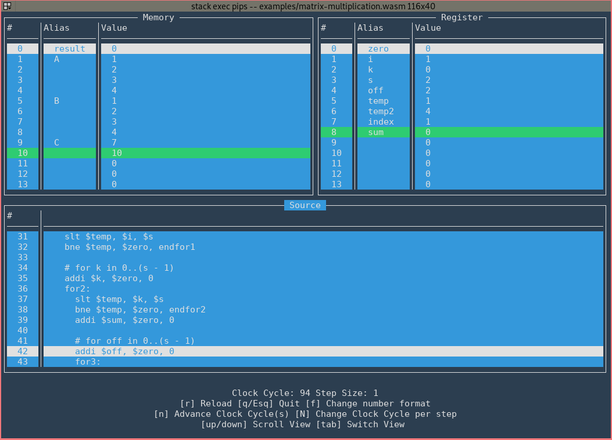

# PIPS - A Poorman's version of the MIPS Architecture
This is a simulation of a simplified single cycle MIPS Architecture written in Haskell.

## Installation
Installation requires stack. To build use the following.
```
stack build
```
## Usage
The program can be executed with `stack exec pips --`. For usage see below.

```
pips - a simulator for a poor man's MIPS architecture

Usage: pips SOURCE_FILE [-m SIZE] ([--no-tui N] | [--debug] |
            [--assembler-output] | [--parser-output])
  Simulate SOURCE_FILE

Available options:
  SOURCE_FILE              Assembly file to run
  -m SIZE                  SIZE of memory in 32-bit words (default: 32)
  --no-tui N               Runs the simulator for N cycles, without the tui
  --debug                  Run the simulator in debug mode
  --assembler-output       Output the assembler's output, and stop the program
  --parser-output          Output the parser's output, and stop the program
  -h,--help                Show this help text

```

## Supported instructions
The table below shows which instruction are supported and their semantics. 
For example assembly files, see the `examples` folder.

| Syntax                          | Example               | Semantics                              |
| ---                             | ---                   | ---                                    |
| add \<reg\>, \<reg\>, \<reg\>   | add $res, $1, $2      | $res = $1 + $2                         |
| sub \<reg\>, \<reg\>, \<reg\>   | sub $res, $1, $2      | $res = $1 - $2                         |
| and \<reg\>, \<reg\>, \<reg\>   | and $res, $1, $2      | $res = $1 & $2                         |
| or \<reg\>,  \<reg\>, \<reg\>   | or $res, $1, $2       | $res = $1 \| $2                        |
| xor \<reg\>, \<reg\>, \<reg\>   | xor $res, $1, $2      | $res = $1 ^ $2                         |
| slt \<reg\>, \<reg\>, \<reg\>   |  slt $res, $1, $2     | if $1 < $2 then $res = 1 else $res = 0 |
| mult \<reg\>, \<reg\>, \<reg\>  | mult $res, $1, $2     | $res = $1 \* $2                        |
| sll \<reg\>, \<reg\>, \<shamt\> | sll $res, $1, 16      | $$res = $1 << 16                       |
| srl \<reg\>, \<reg\>, \<shamt\> | srl $res, $1, 16      | $res = $1 >> 16                        |
| addi \<reg\>, \<imm\>           | addi $res, $1, 10     | $res = $1 + 10                         |
| lui \<reg\>, \<reg\>, \<imm\>   | lui $res, 10          | $res = $1 \| (10 << 16)                |
| lw \<reg\>, \<addr\>, \<reg\>   | lw $el, array, $index | $el = Mem\[$array + $index\]           |
| sw \<reg\>, \<addr\>, \<reg\>   | sw $index, array, $el | Mem\[array + $index\] = $el            |
| beq \<reg\>, \<reg\>, \<label\> | beq $1, $2, Loop      | jump to Loop if $1 = $2                |
| bne \<reg\>, \<reg\>, \<label\> | bne $1, $2, Loop      | jump to Loop if $1 != $2               |
| j \<label\>                     | j Exit                | jump to label Exit                     |
| jr \<reg\>                      | jr $3                 | jump to instruction $3                 |

## Screenshot

